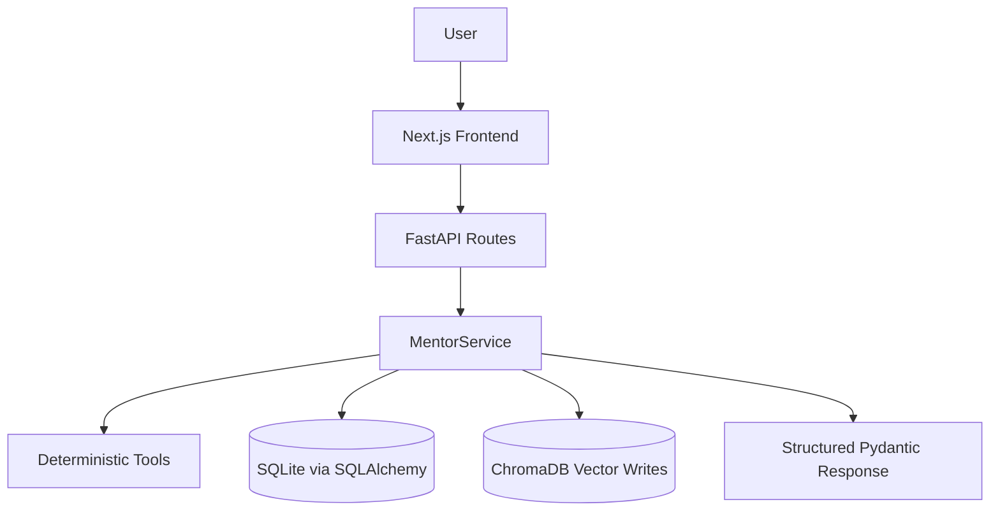
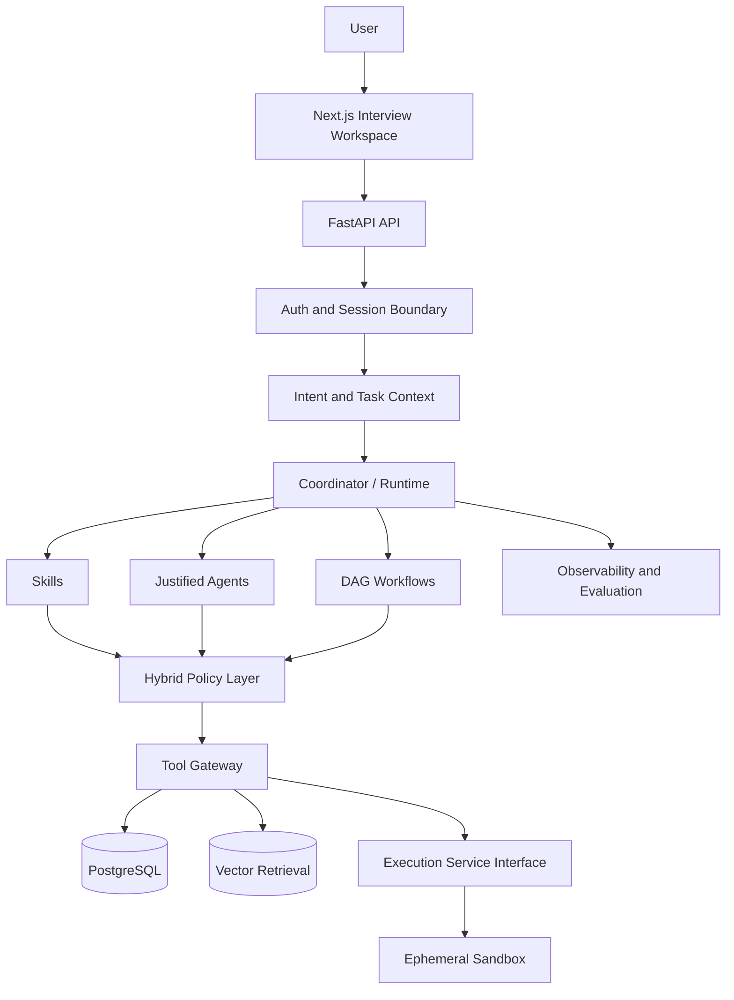

# AlgoFlow Architecture

This document summarizes current and target architecture. For the detailed target design, see [docs/architecture/system-overview.md](architecture/system-overview.md). For evidence-backed current behavior, see [docs/audits/current-system-audit.md](audits/current-system-audit.md).

## Current Runtime Architecture

Current truth:

- FastAPI routes call `MentorService` directly.
- `MentorService` invokes deterministic Python tools and persistence helpers.
- ADK agents are defined in `backend/app/agents/adk_agents.py` but are not invoked in the live request path.
- ChromaDB retrieval is used as bounded, same-user advisory memory context in mentor workflows.
- Mock interviews now persist transcript and rubric scorecard state in `interview_sessions`.
- Analytics derive readiness components, topic risk, mistake trends, learning velocity, next best actions, and mock-interview readiness from persisted learner evidence without invoking a live model.

## Target Architecture Direction

## Primitive Strategy

- Use deterministic logic for predictable classification and calculations.
- Use tools for bounded capabilities such as retrieval, analytics queries, and execution requests.
- Use Skills for reusable procedures such as progressive hinting and code review.
- Use workflows for predictable multi-stage processes.
- Use autonomous agents only where state ownership, multi-turn adaptation, or autonomous routing is justified.

## Current Major Gaps

- OAuth/OIDC is not integrated yet; production-like mode uses HMAC bearer auth or explicit trusted-header auth.
- ADK remains a narrow coordinator route, not a broad all-agent runtime.
- Mock interviews are deterministic and stateful, not live Gemini interviewer sessions.
- Analytics remain deterministic and evidence-backed; they are not yet a live narrative analytics agent or predictive readiness model.
- No secure code execution service.
- No Alembic migration files or cloud deployment pipeline yet.

## Production Evolution

The migration plan intentionally phases work to avoid architecture cosplay:

1. Specs and contracts.
2. Runtime boundary cleanup and observability.
3. Agent/Skill/workflow rationalization.
4. Learning events and learner intelligence.
5. Adaptive hinting and code intelligence.
6. Secure execution boundary.
7. Real bounded ADK runtime integration.
8. Evaluation, security hardening, cloud readiness, CI/CD.
