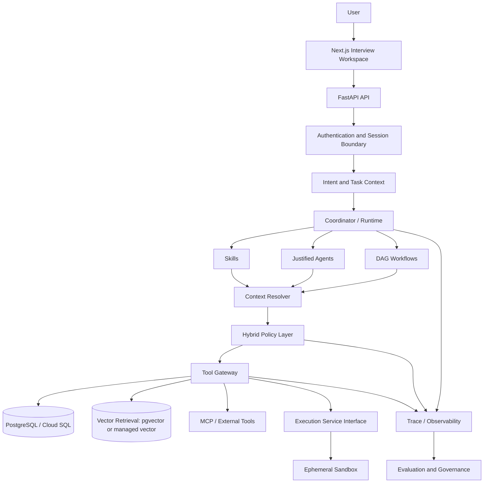

# Target System Architecture

Date: 2026-07-05

AlgoFlow should evolve into an adaptive coding interview intelligence platform through bounded, evidence-driven phases. This target architecture is a decision framework, not permission to create every box immediately.

## Target Architecture Diagram

## Component Decisions

### Next.js Interview Workspace

- Problem solved: gives learners a workspace for problem context, hints, review, interviews, analytics, and session history.
- Needed now: yes, but current pages need API-contract alignment and removal of fake dashboard data.
- Simpler mechanism: existing pages are enough for Phase 1; code editor and charts can wait.
- Operational cost: low.
- Security impact: must avoid rendering executable model-generated UI.
- Evaluation strategy: browser smoke tests and accessibility checks.

### FastAPI API

- Problem solved: typed HTTP boundary and backend orchestration entrypoint.
- Needed now: yes.
- Simpler mechanism: current routes are acceptable but need error envelopes, request IDs, auth-derived users, and route/service separation.
- Operational cost: low to medium.
- Security impact: must become the enforcement point for identity and policy.
- Evaluation strategy: API contract tests and failure-path tests.

### Authentication and Session Boundary

- Problem solved: prevents client-supplied identity and cross-user memory access.
- Needed now: yes before any production deployment or multi-user demo.
- Simpler mechanism: development auth middleware with signed local user plus production OIDC later.
- Operational cost: medium.
- Security impact: critical.
- Evaluation strategy: authorization tests for IDOR and tenant isolation.

### Intent and Task Context

- Problem solved: preserves what the user actually asked for, such as “one hint” vs “full solution”.
- Needed now: yes for adaptive hinting and safe memory writes.
- Simpler mechanism: typed `TaskContext` object before full context service.
- Operational cost: low.
- Security impact: reduces intent drift.
- Evaluation strategy: intent classification tests and hint leakage evals.

### Coordinator / Runtime

- Problem solved: selects the correct Skill/workflow/agent and enforces limits.
- Needed now: partially. Current deterministic service should remain until contracts/evals exist; ADK integration should follow Phase 3.
- Simpler mechanism: deterministic router + trace first, ADK coordinator later.
- Operational cost: medium/high once model-backed.
- Security impact: must not receive broad tool/database authority.
- Evaluation strategy: routing accuracy, trajectory quality, max-step tests.

### Skills

- Problem solved: represent reusable procedures such as progressive hinting and code review without pretending they are autonomous agents.
- Needed now: yes.
- Simpler mechanism: markdown Skill contracts plus deterministic runners before model-backed Skills.
- Operational cost: medium.
- Security impact: supports progressive disclosure and smaller context.
- Evaluation strategy: Skill trigger/collision evals.

### Justified Agents

- Problem solved: autonomous ownership for coordination and stateful mock interviews.
- Needed now: coordinator later; mock interviewer after session state exists.
- Simpler mechanism: workflows for deterministic features.
- Operational cost: high due model calls, tracing, evals.
- Security impact: agents need explicit permission scopes and policy gating.
- Evaluation strategy: agent trajectory and session convergence evals.

### DAG Workflows

- Problem solved: predictable multi-stage tasks such as code review pipeline and study-plan refresh.
- Needed now: yes after Phase 2.
- Simpler mechanism: service methods with explicit typed steps.
- Operational cost: medium.
- Security impact: easier to inspect than free-form agent loops.
- Evaluation strategy: workflow state transition tests.

### Context Resolver

- Problem solved: constructs bounded trusted/untrusted context with provenance and budgets.
- Needed now: before live LLM/RAG personalization.
- Simpler mechanism: typed context builder per feature.
- Operational cost: medium.
- Security impact: high; prevents prompt injection from user/retrieved content overriding policy.
- Evaluation strategy: prompt-injection and retrieval-provenance tests.

### Hybrid Policy Layer

- Problem solved: structural and semantic gating for tool use and state mutation.
- Needed now: structural policy is needed before auth/memory writes are production; semantic policy can be phased.
- Simpler mechanism: centralized Python policy service first.
- Operational cost: medium.
- Security impact: critical.
- Evaluation strategy: policy denial tests and intent-drift evals.

### Tool Gateway

- Problem solved: typed, authorized, observable tool execution.
- Needed now: before external tools, code execution, or broad memory access.
- Simpler mechanism: local registry with schemas and permission metadata.
- Operational cost: medium.
- Security impact: high.
- Evaluation strategy: tool argument/result validation tests.

### PostgreSQL / Cloud SQL

- Problem solved: durable multi-user structured state.
- Needed now: not for local prototype, yes for production migration.
- Simpler mechanism: keep SQLite for local but add migration-ready schema and config guardrails.
- Operational cost: medium.
- Security impact: enables constraints, isolation, transactions.
- Evaluation strategy: database integration tests and migration tests.

### Vector Retrieval

- Problem solved: semantic retrieval of prior learning events, misconceptions, and tutoring context.
- Needed now: retrieval policy before scale migration.
- Simpler mechanism: Chroma local for dev, pgvector likely before Vertex AI Vector Search.
- Operational cost: medium.
- Security impact: retrieved content is untrusted and must be scoped by user.
- Evaluation strategy: Recall@K, MRR, nDCG, prompt-injection tests.

### Execution Service and Ephemeral Sandbox

- Problem solved: safely compile/run learner code and find counterexamples.
- Needed now: interface and disabled stub; real sandbox later.
- Simpler mechanism: no execution until sandbox exists.
- Operational cost: high.
- Security impact: critical.
- Evaluation strategy: security tests proving API never executes code locally; sandbox resource-limit tests later.

### Observability

- Problem solved: reconstruct runtime behavior, costs, failures, and evaluation signals.
- Needed now: request IDs and structured logs in Phase 2.
- Simpler mechanism: standard logging middleware before OpenTelemetry export.
- Operational cost: medium.
- Security impact: must avoid logging secrets/code unnecessarily.
- Evaluation strategy: log/trace presence tests.

### Evaluation and Governance

- Problem solved: measures whether AI behavior is safe, helpful, and improving.
- Needed now: yes before changing agent behavior.
- Simpler mechanism: deterministic fixture-based eval runner with mocked model outputs.
- Operational cost: medium.
- Security impact: catches leakage/intent drift.
- Evaluation strategy: this is the subsystem; CI should run selected suites.

## Recommended Architecture Sequence

1. Make documentation truthful and establish specs/contracts.
2. Add request IDs, error envelopes, and baseline observability.
3. Introduce auth/session boundary and structural policy for user-scoped data.
4. Rationalize agents into Skills/workflows/tools.
5. Build learning event and learner model foundations.
6. Implement adaptive hinting with leakage evals.
7. Add code intelligence layers before any execution.
8. Add disabled execution interface and later isolated sandbox.
9. Integrate bounded ADK runtime once contracts/evals/observability exist.
10. Prepare Cloud Run/Cloud SQL deployment and CI/CD.
