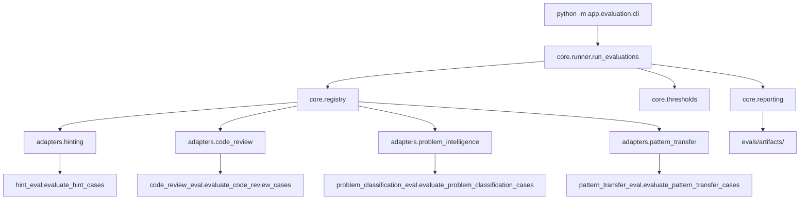

# Unified Evaluation Architecture

Status: Current
Owner: AlgoFlow
Phase: Unified Evaluation Platform Consolidation

## Purpose

AlgoFlow evaluates mentoring intelligence with a shared platform instead of isolated scripts. The platform standardizes orchestration, typed results, gates, artifacts, and reporting while preserving capability-specific semantics.

## Current Architecture

## Design Decision

The platform uses capability adapters rather than rewriting existing evaluators. Each adapter translates legacy suite output into common typed protocols:

- `EvalCaseResult` for per-case behavior.
- `EvalSuiteResult` for suite-level metrics, gates, baseline data, and raw legacy output.
- `EvalRunResult` for run identity, summary, artifacts, and process exit code semantics.

This avoids a false uniformity trap: hint leakage, code-review precision, classification recall, and transfer relevance are not the same metric family. The common layer standardizes execution and reporting, not capability meaning.

## Current Components

- `backend/app/evaluation/core/models.py`: typed case, result, gate, suite, and run protocols.
- `backend/app/evaluation/core/registry.py`: suite registration and aliases.
- `backend/app/evaluation/core/runner.py`: shared runner with suite and split selection.
- `backend/app/evaluation/core/metrics.py`: metric registry and catalog.
- `backend/app/evaluation/core/thresholds.py`: release gate policies.
- `backend/app/evaluation/core/reporting.py`: human summaries and JSON artifacts.
- `backend/app/evaluation/adapters/`: capability adapters for existing suites.
- `backend/app/evaluation/cli.py`: command-line interface.

## Current Suite Coverage

- Progressive hinting: 5 leakage and intervention cases.
- Code review: 16 cases with workflow precision, legacy precision, unsupported-claim rate, rewrite policy, and structured-output validity.
- Problem intelligence: 30 cases with topic and pattern metrics plus baseline comparison.
- Pattern transfer: 15 cases with development, held-out, and adversarial split metrics.

## Deferred

The architecture is ready for future ADK routing, trajectory, memory retrieval, learner-state, and model-judge evaluation, but this phase intentionally does not add live ADK, Gemini, or LLM-as-judge calls.
